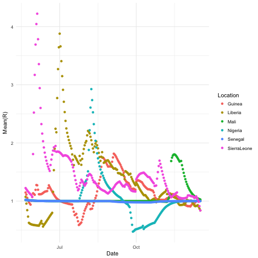
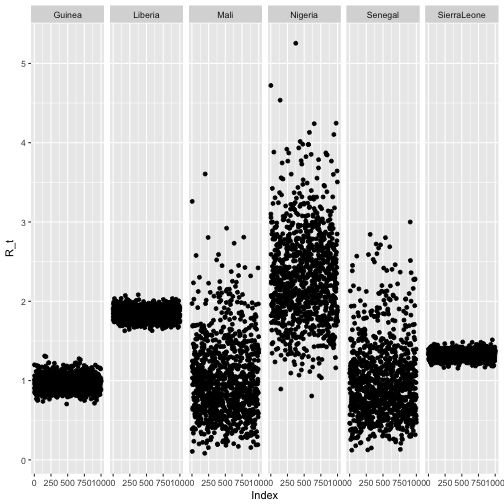

# Introduction

```{r setup}
library(magrittr)
library(ggplot2)
library(dplyr)
library(EpiEstim)
devtools::load_all()

pow_dist    <- params$pow_dist
t.proj      <- params$t.proj
n.sim       <- params$n.sim
n.dates.sim <- params$n.dates.sim
p.stay      <- params$p.stay

```


```{r ds1_params}

species   <- "Humans"
disease   <- "Ebola"
case.type <- "SCC"

```

# Parameters for Ebola and Reproduction Number Estimation

Culled from [literature](http://www.nejm.org/doi/suppl/10.1056/NEJMc1414992/suppl_file/nejmc1414992_appendix.pdf)


```{r ebola_params}

mean_SI     <- 14.2
CV_SI       <- 9.6 / 14.2
SItrunc     <- 40
SI_Distr    <- sapply(0:SItrunc, function(e) DiscrSI(e, mean_SI, mean_SI * CV_SI))
SI_Distr    <- SI_Distr / sum(SI_Distr)
time_window <- 7 * 7

```

# Gravity model parameters

```{r gm_params}

pow_N_to <- pow_N_from <- 1
K        <- 1

```


# Data clean-up

Visualising the raw data.

```{r}

healthmap <- "data/CaseCounts/raw/HealthMap_Ebola_GNE_WHO.csv" %>%
                 read.csv(stringsAsFactors = FALSE)

healthmap$Issue.Date %<>% as.Date(format = "%m/%d/%y")

```

```{r hm_rawviz, eval = TRUE}

healthmap.raw <- healthmap %>%
                 filter(Species == species,
                               Disease == disease) %>%
                 select(Issue.Date, SC, SD, CC, CD, Country)

healthmap.raw %>%
  tidyr::gather(case_type,
                count, -c(Issue.Date, Country)) %>%
  ggplot(aes(Issue.Date, count, color = case_type)) +
  geom_point() +
  theme_minimal() +
  facet_wrap(~Country) +
  xlab("Date") + ylab("Cumulative Case Count")

```
The data clean-up consists of the following steps:
1. Extract the cumulative case count as a sum of suspected and
confirmed cases.
2. Merge duplicate alerts.
3. Remove outliers and interpolate missing data.
4. Determine the incidence count from the cumulative case count.


```{r}
w.africa    <- healthmap$Country %>% unique

cols.to.keep <- c("Location", "Country", "Disease", "Species",
                   "HealthMap.Alert.ID", "Headline", "URL",
                  "Alert.Tag", "Feed.Name", "Lon", "Lat")
## These are columns we generate ourselves later on
cols.to.keep <- c(cols.to.keep, "Date", "Cases") 

## params for outlier removal.
use.last   <- 20
p.within.k <- 0.50
k.sd       <- interval.width.for.p(use.last,
                                   1 - p.within.k) %>%     sqrt %>% `[`(2)


by.location <- healthmap %>%
                split(.$Country) %>%
                lapply(function(case.count){
                    case.count %<>% update.cases.column(case.type) 
                    results <- list(update_cases_col =
                                        case.count[, c("Date", "Cases")])
                    case.count %<>% merge.duplicates(cols.to.keep)
                    results    %<>% c(merge_duplicates =
                                          list(case.count[, c("Date", "Cases")]))
                    
                    case.count %<>% arrange(Date) 

                    not.na          <- which(!is.na(case.count$Cases))
                    cum.incidence   <- case.count[not.na, c('Date', 'Cases')]
                    first.row       <- case.count[1, c('Date', 'Cases')]
                    first.row$Date  <- first.row$Date - 1
                    first.row$Cases <- 0

                    cum.incidence %<>% rbind(first.row, .)


                   cum.incidence %<>%
                       remove.last.outliers(use.last=use.last, k.sd=k.sd)
                   results %<>% c(outliers_removed = list(cum.incidence)) 

                   cum.incidence %<>% make_monotonically_increasing
                   results %<>% c(make_increasing = list(cum.incidence))
                    
                   cum.incidence %<>% interpolate.missing.data
                   results %<>% c(interpolate  = list(cum.incidence))

                    results %<>% bind_rows(.id = "cleanup_step")
                    
                   return(results)}) 
    
by.location[["Liberia"]]$cleanup_step %<>% factor
by.location[["Liberia"]] %<>%
    mutate(cleanup_step = fct_recode(cleanup_step, 
                                     "Cases" = "update_cases_col",
                                     "Merge Duplicates" = "merge_duplicates",
                                     "Outliers Removed" = "outliers_removed",
                                     "Make increasing" = "make_increasing",
                                     "Interpolate" = "interpolate"))

by.location[["Liberia"]]$cleanup_step %<>% fct_inorder
 
ggplot(by.location[["Liberia"]], aes(Date, Cases)) +
    facet_wrap(~cleanup_step) +
    geom_point() +
    theme_minimal() +
    theme(axis.text.x=element_text(angle = -80, hjust = 0))


```

```
## Warning in as.POSIXlt.POSIXct(x, tz): unknown timezone 'zone/tz/2017c.1.0/
## zoneinfo/Europe/London'
```

```{r}
## Even at this point we have several NAs because for a given date,
## we don't have data for all locations.
## Fortunately the dates are regularly spaced even after the step below.

by.location %<>% `[`(complete.cases(.), )

## Subset the incidence counts. we are not going to use any other column
## except date which we will grab from by.location data frame
by.location.incidence <- by.location[, grep("incid", names(by.location))]
colnames(by.location.incidence) %<>%
                          lapply(function(s){
                                       strsplit(s, split = "[.]") %>%
                                       unlist  %>%
                                       `[`(1)}) %>% unlist %>%
                                       gsub(" ", "", ., fixed = TRUE)

## We will now split our data into training and validation sets.
training   <- cbind(Date = by.location$Date[1:t.proj],
                    by.location.incidence[1:t.proj, ])
validation <- cbind(Date = by.location$Date[(t.proj + 1):nrow(by.location.incidence)],
                          by.location.incidence[(t.proj + 1):nrow(by.location.incidence), ])
weekly.available <- c(training    = list(training),
                       validation = list(validation)) %>%
                       lapply(daily.to.weekly) %>%
                       bind_rows(.id = "Category")
```

```
## Error in select(., -Date): could not find function "select"
```

```{r}
## Using incidence count to estimate reproduction number.
start     <- 1:(length(by.location$Date) - time_window)
end       <- start + time_window
end.dates <- by.location[end, "Date"]
r.estim   <- by.location.incidence  %>%
                   plyr::alply(2, .dims = TRUE, function(incid) {
                                                 res <- EstimateR(incid[, 1], T.Start = start , T.End = end,
                                                                  method = "NonParametricSI",
                                                                  SI.Distr = SI_Distr,
                                                                  plot = FALSE ,
                                                                  CV.Posterior = 1 ,
                                                                  Mean.Prior = 1 ,
                                                                  Std.Prior = 0.5)
                                                 res$R %<>% cbind(Date = end.dates)
                                                 return(res$R)})

## Plotting estimate of R for each country
r.estim %>%
    bind_rows(.id = 'Location') %>%
    ggplot(aes(Date, `Mean(R)`, color = Location)) + geom_point() + theme_minimal()
```

```
## Warning: Removed 6 rows containing missing values (geom_point).
```



```{r}
## End of plotting R

## We assume that the reproduction number remains unchanged for the time
## period over which we wish to project. For each location, distribution of
## r_t at t.proj is r_t over the next n.days.sim.
r.j.t <- r.estim %>%
           lapply(function(R){
                     cutoff <- which(R$Date %in% by.location[t.proj, "Date"])
                     shape  <- R[cutoff, "Mean(R)"]^2 / R[cutoff, "Std(R)"]^2
                     scale  <- R[cutoff, "Std(R)"]^2 / R[cutoff, "Mean(R)"]
                     return(rgamma(n.sim, shape = shape,
                                          scale = scale))}) %>% data.frame

colnames(r.j.t) <- colnames(by.location.incidence)

r.j.t %>% cbind(Index = 1:n.sim, .) %>%
    reshape2::melt(id.vars = "Index") %>%
    rename(Country = variable, R_t = value) %>%
        ggplot(aes(Index, R_t)) + geom_point() + facet_grid(. ~ Country)
```



```{r}
## Determine the flow matrix for the countries of interest only.
adm0_centroids <- "data/Geography/GravityModel/raw/adm0_centroids.tsv" %>%
                   read.csv(stringsAsFactors = FALSE, sep = "\t", header = FALSE) %>%
                   filter(V1 %in% w.africa)
names(adm0_centroids) <- c("country", "id", "lon", "lat", "pop")
flow.matrix           <- flow_matrix(longitude = adm0_centroids[, "lon"],
                                     latitude  = adm0_centroids[, "lat"],
                                     population = adm0_centroids[, "pop"],
                                     place.names = adm0_centroids[, "country"],
                                     model = "gravity",
                                     K = K, pow_N_from = pow_N_from,
                                     pow_N_to = pow_N_to, pow_dist = pow_dist)


## Relative risk
relative.risk <- flow.matrix / rowSums(flow.matrix, na.rm=TRUE)

## matrix characterising the population movement between geographical units
# p.stay      <- 0.99 # this can be a vector
# p.movement  <- probability_movement(relative.risk, p.stay)


## At this point, all the pieces are in place.
## by.location contains the incidence count
## r.j.t contains the estimates of reproduction numbers.
## p.movement conatins the probabilities.
## SI_Distr is the serial interval distribution.
## The model is: lambda.j.t = p.movement * (incidence * r_t) * serial_interval
## taking care of the dimensions of course.
## Now divide the dataset into training and validation sets.

incidence.count <- by.location.incidence[1:t.proj, ]
incid           <- as.matrix(incidence.count)
dates.all       <- by.location[1:t.proj, "Date"] %>%
                       c(seq(max(.) + 1, length.out = n.dates.sim, by = 1))
t.max           <- nrow(incidence.count) + n.dates.sim - 1
##ws            <- c(SI_Distr, rep(0, t.max - length(SI_Distr) + 1)) %>% rev

## Each row of r.j.t is a set of reproduction numbers at each
## location for one simulation.
p.stay      <- 0.99
p.movement  <- probability_movement(relative.risk, p.stay)
daily.projections <- plyr::alply(r.j.t, 1, function(r.t){
                                    r.t   <- as.matrix(r.t)
                                    out   <- project(incid, r.t, SI_Distr,
                                                     p.movement, n.dates.sim)
                                    colnames(incid) <- colnames(incidence.count)
                                    incidence.proj  <- rbind(incidence.count, out)
                                    incidence.proj %<>% cbind(Date = dates.all)
                                    return(incidence.proj[(nrow(incidence.count) + 1):t.max, ])})


weekly.projections <- lapply(daily.projections, daily.to.weekly) %>% bind_rows(.)
```

```
## Warning in FUN(X[[i]], ...): Number of rows is not a multiple of 7.
```

```
## Warning in FUN(X[[i]], ...): Ignoring last 6 days.
```

```
## Error in select(., -Date): could not find function "select"
```

```{r}
plots.list         <- lapply(colnames(by.location.incidence), function(location){
                                available  <- weekly.available[, c("Date", "Category", location)]
                                projection <- weekly.projections[, c("Date", location)]
                                plot.weekly(available, projection)})
```

```
## Error in FUN(X[[i]], ...): object 'weekly.available' not found
```

```{r}
p <- cowplot::plot_grid(plots.list[[1]], plots.list[[2]], plots.list[[3]],
                        plots.list[[4]], plots.list[[5]], plots.list[[6]])
```

```
## Error in cowplot::plot_grid(plots.list[[1]], plots.list[[2]], plots.list[[3]], : object 'plots.list' not found
```

```{r}
cowplot::save_plot("scratch.png", p,
                    base_aspect_ratio = 1.3)
```

```
## Error in grid::grid.draw(plot): object 'p' not found
```

