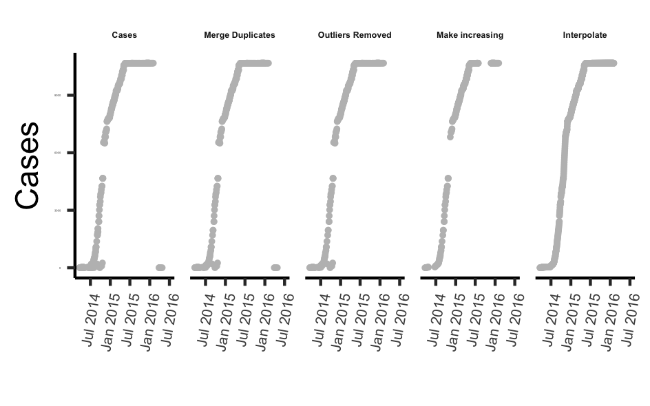
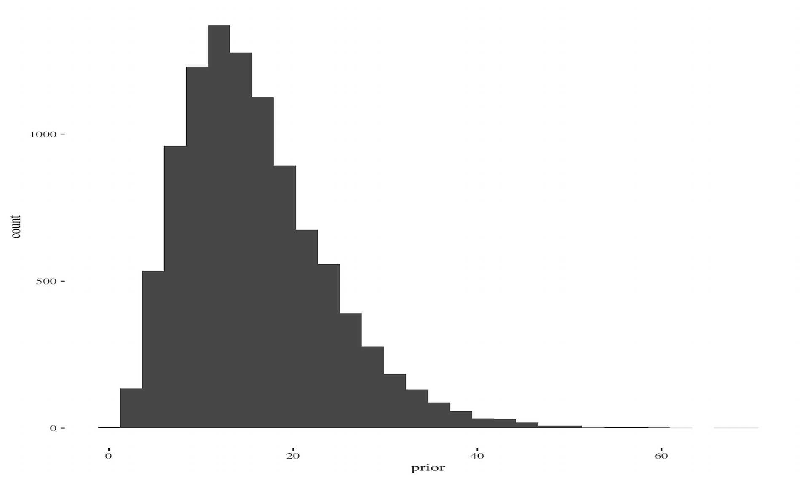
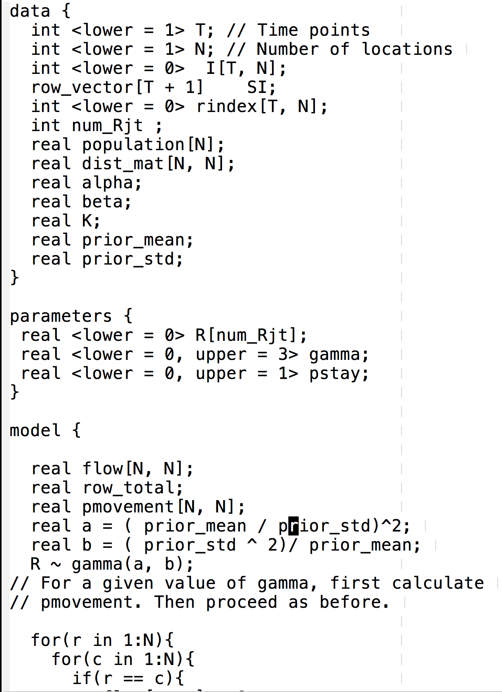
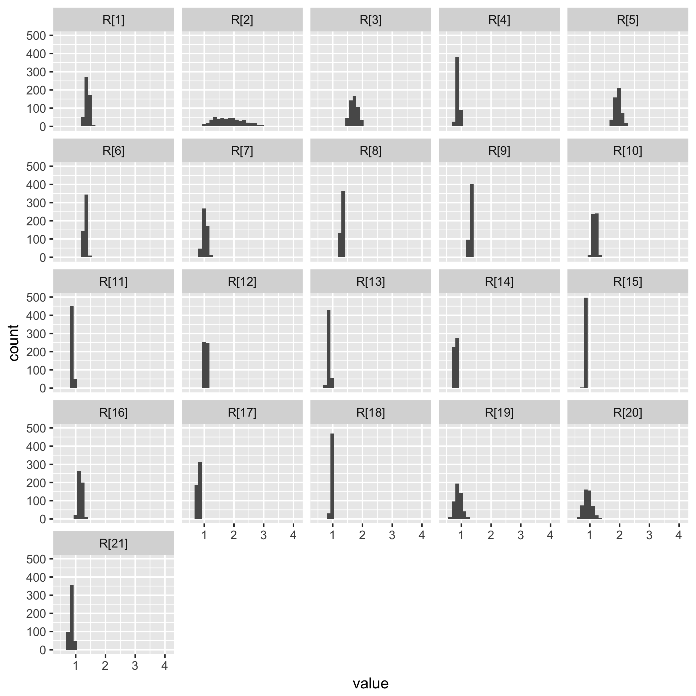

```{r setup, include=FALSE}
options(htmltools.dir.version = FALSE)
```

# Our Brave New World

.center[]

---

# Big Brother Is Watching

.center[]
---

# Crisis Response 

.center[]
---

# mRIIDS - Mapping the Risk of International Infectious Disease Spread
.center[]

---
# Project partners - ProMed, HealthMap and HealthSites

.center[]
---

# Project Schematic

.center[.largeimg[]]

---
# Model

Excpected number of cases at a location is influenced by

+ local past incidence;

+ pathogen characteristics - reproduction number, serial interval;

+ local health access quality; 

+ movement between neighboring locations

$$I_{t, j} \sim Pois\left( \sum_{i = 1}^{n} {\left( p_{i \rightarrow j}
  R_{t, i} \sum_{s = 1}^{t}{I_{t - s, i} w_{s}}\right)} \right),$$
where
$$R_{t, i} := f(haq_i, R_0, t).$$

$haq_i$ is a measure of health access quality index at a given location.


---
# Movement between spatial units
Approximated by a phenomenological model (e.g. gravity<sup>1</sup> or radiation model<sup>2</sup>), or informed by other sources such as air or road traffic data.

$$p_{i \rightarrow j} = (1 - p_{stay}^i)\frac{\phi_{i \rightarrow j}}{\sum_{x}{\phi_{i \rightarrow
  j}}}$$
  
.footnote[[1] Grosche, T., Rothlauf, F., & Heinzl, A. (2007). Gravity models for airline passenger volume estimation. Journal of Air Transport Management, 13(4), 175-183.

[2] Simini, F., González, M. C., Maritan, A., & Barabási, A. L. (2012). A universal model for mobility and migration patterns. Nature, 484(7392), 96.]
---

# Models of movement

Gravity model

$$\phi_{ij} = k\frac{N_i^{\alpha} N_j^{\beta}}{d_{ij}^{\gamma}}$$
Radiation model
$$\phi_{ij} = {\phi}_i \frac{N_i N_j}{(N_i + s_{ij})(N_i + N_j + s_{ij})}$$
---
# HealthMap and ProMed data pre-processing
.center[]
---
# Incidence from WHO, HealthMap and ProMed

.center[]

---
# Reproduction Number from WHO, HealthMap and ProMed

.center[]

---
# Parameter estimation - prior on Reproduction Number
.center[]

---
# MCMC time!

.center[]

---
# Posterior Distribution of Reproduction Number

.center[]

---
# Prediction using data from HealthMap

.center[]

---

# Prediction using data from HealthMap
.center[]
---

# Prediction - at district level (WHO data)

.center[]


---
# Next steps

+ Include health care capacity in the model.

+ Informative priors for model parameters.

+ Model averaging to account for model uncertainty.

+ How best to choose the window for estimating the reproduction number?


