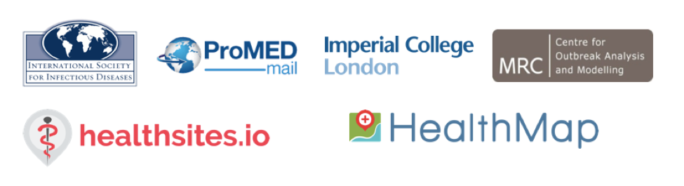

```{r setup, include=FALSE}
options(htmltools.dir.version = FALSE)
```

# Problem Statement

world more connected; more diseases; spreading faster etc.
---

# Role of internet surveillance

Internet surveillance - useful but reliable?
---

# ProMed, HealthMap and HealthSites

.center[]
---

# Project Schematic
.center[]

---
# Model

$$I_{j, t} \sim Pois\left( \sum_{i = 1}^{n} {\left( p_{i \rightarrow j}
  R_{t, i} \sum_{s = 1}^{t}{I_{i, t - s} w_{s}}\right)} \right),$$
where
$$R_{t, i} := f(haq_i, R_0, t).$$
$haq_i$ is a measure of health access quality index at a given location.

---
# Movement between spatial units
$$p_{i \rightarrow j} = (1 - p_{stay}^i)\frac{\phi_{i \rightarrow
  j}}{\sum_{x}{\phi_{i \rightarrow
  j}}}$$

---

# Incidence from WHO, HealthMap and ProMed

.center[]

---
# Reproduction Number from WHO, HealthMap and ProMed

.center[]

---
# Prediction - at country level

---


# Prediction - at district level

---

# Spread over space and time.


---

# Next steps


